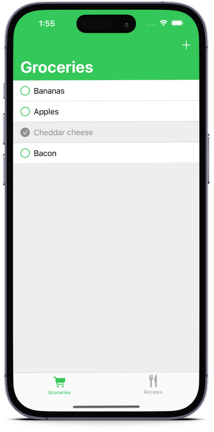
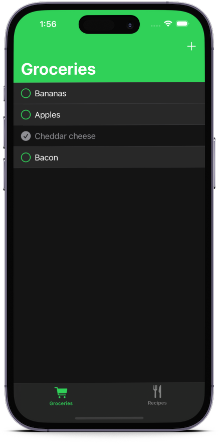
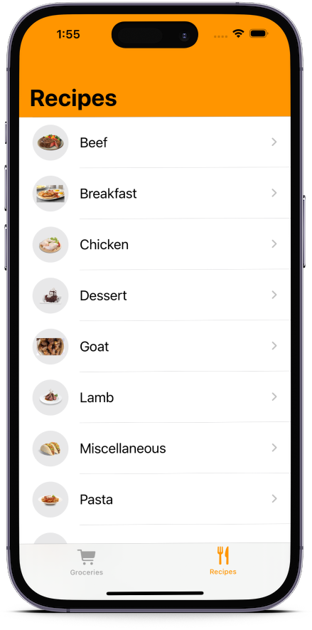
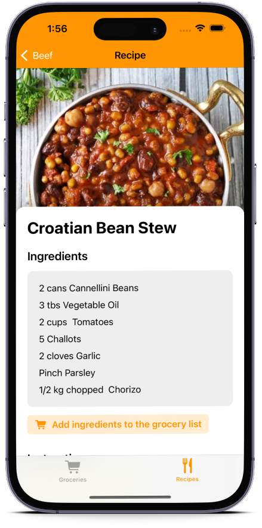
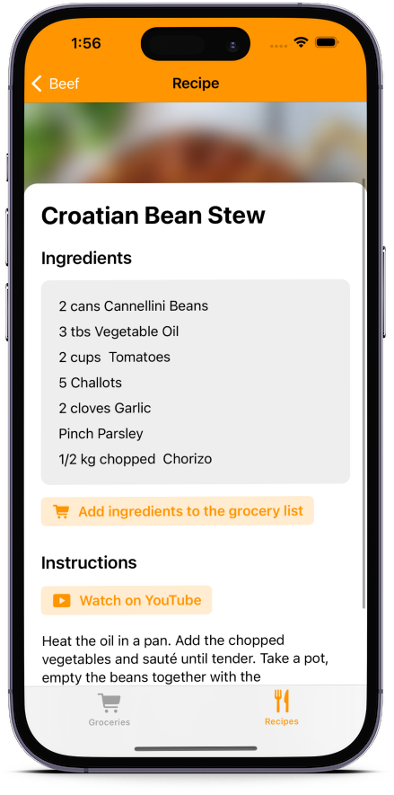
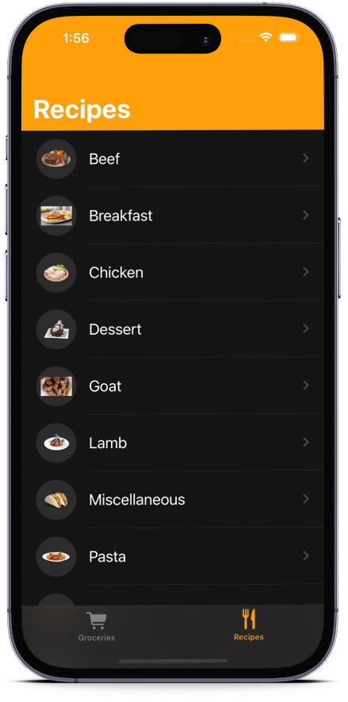
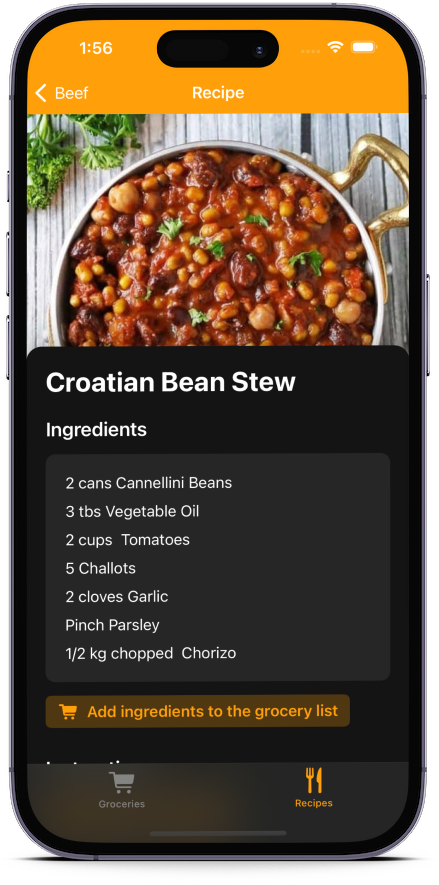
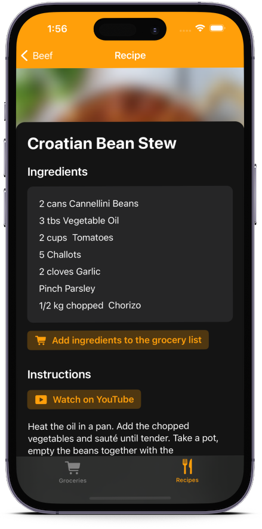

# Foodster

This project's goal is to be used as my personal playground to help me get familiar with the changes made to the iOS and Swift ecosystem in the last years.

This project will also explore the modern iOS architecture patterns beyond the traditional MVC model.

## What is being used on this project

### Architecture patterns

    * MVVM

### Technologies and Frameworks

    * AppIntents (Shortcuts and Siri)
    * Combine
    * Core Data
    * Swift 5
    * Swift Concurrency (Async/await)
    * SwiftUI

## The app

The app has been localized to English and Spanish and it has 2 main sections: the grocery list and the recipe book. The following screenshots give an approximate idea on how they look.

The recipe book's content is obtained from [TheMealDB API](https://www.themealdb.com/api.php).

### Grocery list view

    
    

### Recipe book

    
    
    

### Recipe book (Dark mode)

    
    
    

